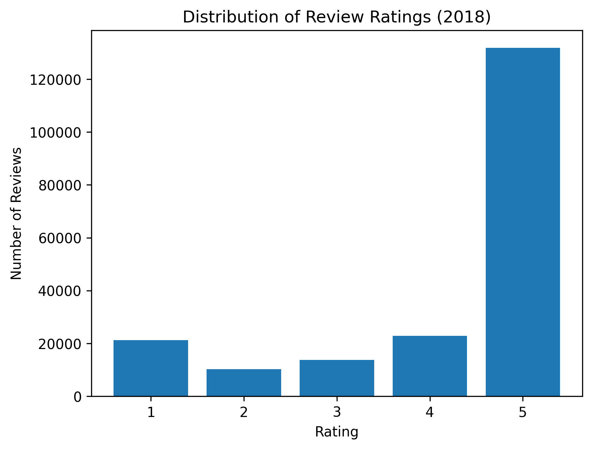
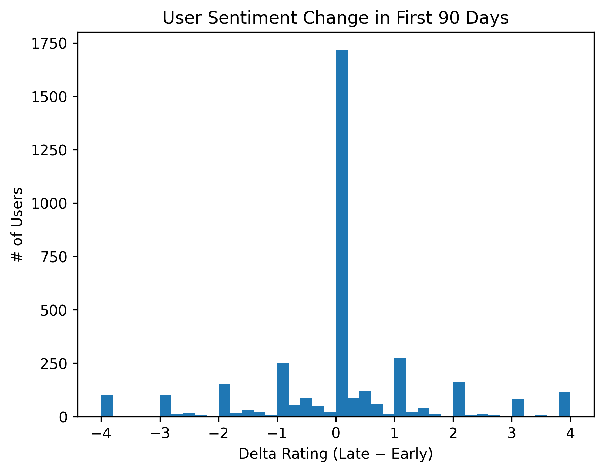
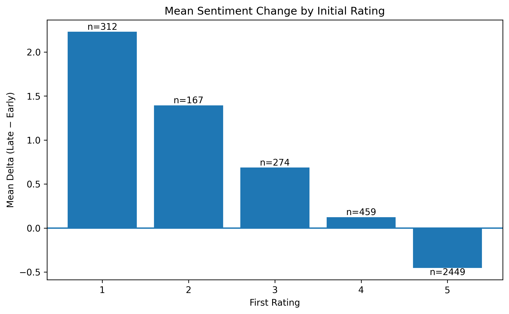

# Amazon Final Draft

# Introduction

How do new users’ sentiments toward Amazon change over time? Initial user experiences can influence long-term engagement and purchasing behavior; 
through understanding user sentiments, Amazon may gain insights into user expectation changes. Using the Amazon Reviews dataset, this analysis examines whether 
new users feel differently about Amazon from the time they initially bought one of their products. Sentiment is measured using review star ratings, whether the “over time”
feature is defined as changes within users during their first 90 days reviewing a product, as observed in 2018.  Rather than a uniform trend, I hypothesize that there will 
be fluctuation when it comes to the change in sentiment among users, regardless if that change is negative or positive.

# Limitations

The original Amazon Reviews dataset (~127 GB) posed as the largest constraint, restricting analysis to reviews from 2018 only. Upon streaming ingestion and writing the files
to Parquet, a “new user” is defined as a reviewer’s first observed rating in 2018. Most users (roughly 72% of users)  left only one review, additionally restricting analysis 
to users with at least two reviews within their first 90 days of activity.

Lastly, ratings are heavily skewed, with most reviews being 4 and 5 stars; This may imply that most users who write a review are the ones who are happy with a product, 
whereas many people who feel indifferent don’t bother to write a review. Because the baseline sentiment is highly positive, detecting meaningful shifts may be statistically 
difficult. Instead of analyzing raw rating levels that could obscure meaningful findings, measuring changes within users mitigates positivity bias and focuses on directional 
sentiment shifts.

# Data Cleaning, Feature Engineering, & Methodology

A “new user” is defined as a reviewer’s first observed rating in 2018. For each eligible user, account age was computed relative to their first time reviewing. Two windows 
were defined within the first 90 days. “Early” window: reviews within the first 30 days, and “Late” window: reviews from days 60–90. Sentiment change, or “delta” per user, 
was then measured as “AvgRating​Late(i) - AvgRatingEarly(i)”. 

# Initial Results 

Among the 3,661 users with activity in both early and late windows, the average “early” rating is 4.26 stars, whereas the average “late” rating is 4.28 stars. The mean 
sentiment change was observed to be 0.017 and a median of 0. About 28.4% of users showed “improvement” in their ratings, 25.4% showed a “decline”, and 46.2% showed no 
measurable change.

With the distribution of sentiment change, or “deltas” heavily concentrated at zero and improvements and declines seeming to happen at similar rates, it is fair to suggest
that new users do not exhibit a meaningful shift in sentiment over the course of 90 days after writing a review.

To formally assess whether there is truly a change in sentiment or not (average sentiment is not 0), a one-sample t-test was conducted on the mean “deltas”.
With H0: E[Delta] = 0, the test yielded a large p-value of 0.479, indicating there is no statistical evidence of a change in average sentiment within the first 90 days.
Moreover, the observed mean change in sentiment (0.0017 stars) further reinforces this.

# Final Results

Although the aggregated sentiment change is zero or near 0, the observed stability may “mask” hidden dynamics within. Subgroup analysis reveals stronger conditional patterns.
Users were now grouped by their first observed rating (1-5), and then the average delta was computed within each group (rather than within-user). 

Now, a semi-clear and much more interesting pattern emerges; users who start off with low ratings exhibit substantial improvement over time (users whose first rating was 1
star improved by about 2.23 stars on average, and those whose first rating was 2 stars by about 1.39 stars. Conversely, users who began highly satisfied (5 stars) show a very
mild decrease (delta of -0.45 stars in 9 months).
Because the majority of users begin with 5-star reviews, slight declines among this group counterbalance strong improvements among initially dissatisfied users. As a result, 
aggregate sentiment appears stable despite meaningful subgroup dynamics, reaffirming the initial results in which the mean sentiment does not change at all.

# Takeaways

At the initial (aggregate) level, sentiment stayed statistically “stable” with nearly half of users displaying no measurable change, not supporting my hypothesis that there 
will be fluctuation in sentiment among users. However, subgroup analysis revealed more interesting findings; users who began with low ratings showed visible improvement over 
time, whereas users who began highly satisfied regressed very slightly. This aligns much more with my hypothesis. Through my findings, it is fair to make the implication that
early sentiment adjustment depends on a user’s initial experience.

